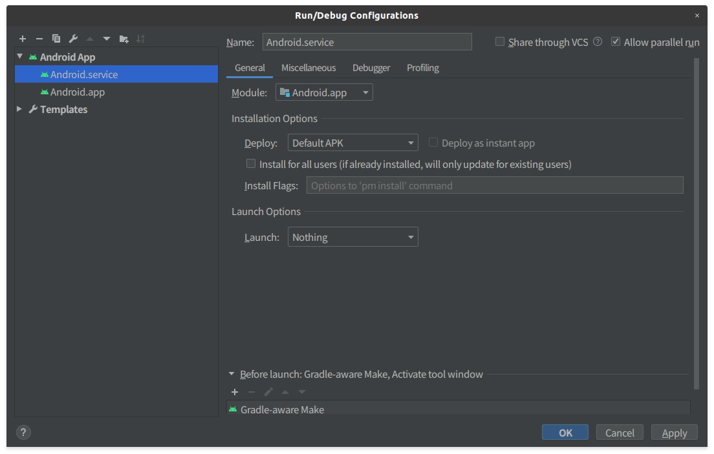

# AAP JUCE audio processor and client modules

This repo is the place where we have JUCE integration support modules for [android-audio-plugin-framework](https://github.com/atsushieno/android-audio-plugin-framework) (AAP), both plugins and hosts, as well as handful of samples.
(Although make sure to check [issues](https://github.com/atsushieno/aap-juce/issues), there are not a few samples that don't work as expected.)

- Host sample
  - [AudioPluginHost](https://github.com/WeAreROLI/JUCE/tree/master/extras/AudioPluginHost/)
- Plugin sample
  - [andes](https://github.com/artfwo/andes/)
  - [SARAH](https://github.com/getdunne/SARAH/)
  - [dexed](https://github.com/asb2m10/dexed/) (we use private fork)
  - [Magical8bitPlug2](https://github.com/yokemura/Magical8bitPlug2/)
  - [OB-Xd](https://github.com/reales/OB-Xd)

The entire AAP framework is on early development phase and not ready for any consumption yet.
Everything is subject to change. Contributions are welcome but documentation is poor, and source code is ugly yet.

It builds on Android and desktop (confirmed only on Linux so far). It can launch, enumerate the installed audio plugins on the system, and instantiate each plugin (only one can be instantiated), but audio inputs are not verified to work.


## Why JUCE?

JUCE is a popular cross-platform, cross-plugin-framework audio development framework.
JUCE itself does not support AAP, but it can be extended by additional modules.
Still, JUCE is not designed to be extensible *enough*, additional code to support AAP is needed in each app.
It also supports Android (you can even run UI), which makes things closer to actual app production.

While JUCE itself is useful to develop frameworks like AAP, it is designed to be independent of any other audio development toolkits and frameworks. We stick to minimum dependencies, at least on the public API surface.


## Why use juce_emscripten?

**UPDATE:** as of current version juce_emscripten is disabled in favor of JUCE 6.0 migration. We might bring back wasm UI support later.

We use [juce_emscripten](https://github.com/Dreamtonics/juce_emscripten/), which is a fork of JUCE that extends its support to WebAssembly world using [emscripten](emscripten.org/).

At this state, we can use the official JUCE distribution, without forking and making any changes for AAP itself. But when we would like to build a plugin UI that can launch from within the host (DAW) application, the WebAssembly bundle is going to make it possible. juce_emscripten is needed for that purpose.

(Note that external UI integration is not implemented in the framework yet.)

Our repository makes use of [our own fork that supports JUCE 5.4.7 and Web MIDI API](https://github.com/atsushieno/JUCE/tree/juce_emscripten/) (which may not be required once Dreamtonics is back on that effort).

UPDATE: after some investigation, it turned out that current Chrome (and inherently Android WebView)  does not support [Actomics](https://developer.mozilla.org/en-US/docs/Web/JavaScript/Reference/Global_Objects/Atomics) which is essential to juce_emscripten internals, therefore it will not work on Android so far.
We keep using juce_emscripten so far though; it may become usable at some stage.


## How to try it out?

You need a host app and a plugin to try at least one plugin via one host.

THe host can be either `aaphostsample` in android-audio-plugin-framework repo, or `AudioPluginHost` in this repo (which is JUCE AudioPluginHost with AAP support).

The plugin can be either `aappluginsample` in android-audio-plugin-framework repo (more stable), or plugins like `samples/andes` in this repo (less stable).

Once you run `make` then those apps are built. JUCE Android apps are built under `Build/Android/app/build/outputs/` in each app directory.
Though we typically use Android Studio and open `Build/Android` and then run or debug there, once top-level `make` ran successfully.


## How can we bring in our own apps and/or plugins?

Conceptually, there are only a few steps:

- Make sure that your JUCE app builds on Android (no AAP required)
- add androidaudioplugin.aar as a dependency
- add `juceaap_audio_plugin_client` or `juceaap_audio_plugin_processors` module depending on whether your app is a plugin or a host.
  - add include and lib paths to your project `.jucer` to make it possible.
- add required service description in AndroidManifest.xml (most likely doable via Projucer).
- prepare `aap_metadata.xml` as an Android resource.

The more details are described later in this README.

At this state, this repository is more of a set of build scripts that lets you bring in your own JUCE based audio plugins into AAP world.
In other words, reusing this repo and adding your plugin as part of `samples` would be the easiest.


## Build Instruction

You most likely need a Linux desktop. It may build on virtual machines, but you might want get a real Linux desktop because Projucer (the JUCE project fileset generator) depends on X11, even without running GUI (of course if you try to get it working on other OSes Projucer doesn't require X11).
It should build on any kind of Linux desktop, but since we cannot make sure to write code that works on every distro, it may fail. So far only Ubuntu 19.10 is the verified desktop.

You need Android SDK. If you install it via Android Studio it is usually placed under `~/Android/Sdk`.
You also need Android NDK 21.0. It would be installed under `~/Android/Sdk/ndk/21.*`.

Once they are all set, simply run `make`.


Depending on the NDK setup you might also have to rewrite `Makefile` and `Builds/Android/local.properties` to point to the right NDK location. Then run `cd Builds/Android && ./gradlew build` instead of `./build-sample.sh`.
It would be much easier to place Android SDK and NDK to the standard location though. Symbolic links would suffice.


## Under the hood

JUCE itself already supports JUCE apps running on Android and there is still
no need to make any changes to the upstream JUCE.

We use juce_emscripten for future plan to integrate with wasm builds.
juce_emscripten is based on 5.4.5-ish so far.

Projucer is not capable of supporting arbitrary plugin format and it's quite incompete.
Thus we make additional changes to the generated Android Gradle project.
It is mostly taken care by `build-sample.sh` and `fixup-project.sh`.


## difference between normal JUCE Android app and JUCE-AAP Android app

Projucer can generate Android apps, and we basically make use of it.
Although its feature is quite insufficient, we don't expect it to generate the entire set of the required files. We (at least on our samples) copy our own support files into the apps instead, namely the top-level `build.gradle`, `gradle-properties` and `settings.gradle`.
It is mostly about AAP dependencies.

We also don't expect that the original `.jucer` files can be simply patched by simple diff tool, so we have an entire `.jucer` file to override for each sample project.
They resolve various relative paths to AAP includes and libs.
Both Projucer and Android Gradle Plugin lack sufficient support to decently resolve them.


## Generating aap_metadata.xml

It is already done as part of `fixup-project.sh` but in case you would like
to run it manually...

To import JUCE audio plugins into AAP world, we have to create plugin
descriptor (`aap_metadata.xml`). We have a supplemental tool source to
help generating it automatically from JUCE plugin binary (shared code).

The command line below builds `aap-metadata-generator` under
`Builds/LinuxMakefile/build` and generates `aap_metadata.xml` at the plugin
top level directory:

```
APP=__yourapp__ gcc (__thisdir__)/tools/aap-metadata-generator.cpp \
	Builds/LinuxMakefile/build/intermediate/Debug/*.o \
	-lstdc++ -ldl -lm -lpthread -lGL \
	-L../../external/android-audio-plugin-framework/build/native/androidaudioplugin -landroidaudioplugin 
	`pkg-config --libs alsa x11 xinerama xext freetype2 libcurl webkit2gtk-4.0` \
	-o aap-metadata-generator \
	&&./aap-metadata-generator aap_metadata.xml
```

## Porting other JUCE-based audio apps (details)

Here are the porting steps that we had. Note that this applies only to samples built under this `samples` directory:

- Run Projucer and open the project `.jucer` file.
- open project settings and ensure to build at least one plugin format (`Standalone` works)
- Ensure that `JUCEPROJECT` has `name` attribute value only with `_0-9A-Za-z` characters. That should be handled by Projucer but its hands are still too short.
  - For example, we had to rename `Andes-1` to `Andes_1`.
- Go to Modules and add module `juceaap_audio_plugin_client` (via path, typically)
- Go to Android exporter section and make following changes:
  - Module Dependencies: add list below
  - minSdkVersion 29
  - targetSdkVersion 29
  - Custom Manifest XML content: listed below
  - Gradle Version 6.5
  - Android Plug-in Version 4.0.0

For module dependenciesm add below:

```
implementation project(':androidaudioplugin')
implementation "org.jetbrains.kotlin:kotlin-stdlib-jdk7:1.3.61"
```

For custom Manifest XML content, replace `!!!APPNAME!!!` part with your own (this is verified with JUCE 5.4.7 and may change in any later versions):

```
<manifest xmlns:android="http://schemas.android.com/apk/res/android" package="org.androidaudioplugin.aappluginsample" android:versionCode="1" android:versionName="0.1">
  <uses-permission android:name="android.permission.FOREGROUND_SERVICE"/>
  <application android:allowBackup="true" android:label="@string/app_name"
               android:supportsRtl="true" android:name="com.roli.juce.JuceApp" android:hardwareAccelerated="false">
    <service android:name="org.androidaudioplugin.AudioPluginService" android:label="!!!APPNAME!!!Plugin">
      <intent-filter>
        <action android:name="org.androidaudioplugin.AudioPluginService"/>
      </intent-filter>
      <meta-data android:name="org.androidaudioplugin.AudioPluginService#Plugins" android:resource="@xml/aap_metadata"/>
    </service>
  </application>
</manifest>
```

Below can be edited with text editor:

- On the top-level `<JUCERPROJECT>` element add `juceFolder="../../external/juce_emscripten"`
- On every `<MODULEPATH>` element, specify `path="../../external/juce_emscripten/modules"` everywhere. Yes, the path on `<JUCERPROJECT>` does not apply here, Projucer is incapable of taking it into consideration.
  - If you don't set `path` to point to the exact location e.g. to the one in the submodule in this repo, then it may result in system global path to JUCE (or fails if it is not installed) and any unexpected build breakage could happen. THe build log would tell if it went as such.
  - If you are copy-pasting `<MODULES>` element, make sure that you do not accidentally remove necessary ones. @atsushieno had spent a lot of time on finding that he was missing `<MODULE>` for `juce_audio_plugin_client` when copying from `AudioPluginHost` to `Andes_1`...
- Add `<MODULEPATH id="juceaap_audio_plugin_processors" path="../../modules"/>` for each `<MODULEPATHS>` for each `<EXPORTFORMAT>`. (You can do this in Projucer too, but copypasting on a text editor is 10x easier.)
- In `<LINUX_MAKE>` and `<ANDROIDSTUDIO>` element, replace `<CONFIGURATION>` elements with the contents explained below for each.

For `<LINUX_MAKE>` for desktop (`Builds/LinuxMakefile`, not to be confused with the one for `EMSCRIPTEN`), below, replacing `!!!APPNAME!!!` part with the actual name:

```
        <CONFIGURATION name="Debug" isDebug="1" targetName="!!!APPNAME!!!"
            headerPath="../../../../external/android-audio-plugin-framework/native/plugin-api/include;../../../../external/android-audio-plugin-framework/native/androidaudioplugin/core/include;${CMAKE_CURRENT_SOURCE_DIR}/../../../../external/android-audio-plugin-framework/native/plugin-api/include;${CMAKE_CURRENT_SOURCE_DIR}/../../../../external/android-audio-plugin-framework/native/androidaudioplugin/core/include"
            libraryPath="/usr/X11R6/lib/;../../../../external/android-audio-plugin-framework/build/native/androidaudioplugin;${CMAKE_CURRENT_SOURCE_DIR}/../../../../external/android-audio-plugin-framework/build/native/androidaudioplugin"/>
        <CONFIGURATION name="Release" isDebug="0" optimisation="2" targetName="!!!APPNAME!!!"
            headerPath="../../../../external/android-audio-plugin-framework/native/plugin-api/include;../../../../external/android-audio-plugin-framework/native/androidaudioplugin/core/include;${CMAKE_CURRENT_SOURCE_DIR}/../../../../external/android-audio-plugin-framework/native/plugin-api/include;${CMAKE_CURRENT_SOURCE_DIR}/../../../../external/android-audio-plugin-framework/native/androidaudioplugin/core/include"
            libraryPath="/usr/X11R6/lib/;../../../../external/android-audio-plugin-framework/build/native/androidaudioplugin;${CMAKE_CURRENT_SOURCE_DIR}/../../../../external/android-audio-plugin-framework/build/native/androidaudioplugin"/>
```

For `<ANDROIDSTUDIO>` (`targetName` attribute can be specified here too, but totally optional):

```
        <CONFIGURATION name="Debug" isDebug="1" 
                       headerPath="${CMAKE_CURRENT_SOURCE_DIR}/../../../../../external/android-audio-plugin-framework/native/androidaudioplugin/core/include;${CMAKE_CURRENT_SOURCE_DIR}/../../../../../external/android-audio-plugin-framework/native/plugin-api/include;${CMAKE_CURRENT_SOURCE_DIR}/../../../../../external/android-audio-plugin-framework/dependencies/tinyxml2"
                       libraryPath="${CMAKE_CURRENT_SOURCE_DIR}/../../../../../external/android-audio-plugin-framework/java/androidaudioplugin/build/intermediates/cmake/debug/obj/${ANDROID_ABI}"
                       optimisation="1" linkTimeOptimisation="0"
                       recommendedWarnings="LLVM"/>
        <CONFIGURATION name="Release" isDebug="0" optimisation="3" linkTimeOptimisation="1"
                       headerPath="${CMAKE_CURRENT_SOURCE_DIR}/../../../../../external/android-audio-plugin-framework/native/androidaudioplugin/core/include;${CMAKE_CURRENT_SOURCE_DIR}/../../../../../external/android-audio-plugin-framework/native/plugin-api/include;${CMAKE_CURRENT_SOURCE_DIR}/../../../../../external/android-audio-plugin-framework/dependencies/tinyxml2"
                       libraryPath="${CMAKE_CURRENT_SOURCE_DIR}/../../../../../external/android-audio-plugin-framework/java/androidaudioplugin/build/intermediates/cmake/release/obj/${ANDROID_ABI}"
                       recommendedWarnings="LLVM"/>
```

Note that those relative paths are valid only if those source directories exist under `samples` directory. Projucer is of a lot of hacks and there is no valid way to specify required paths.
If you don't want to be messed a lot, just specify absolute paths that won't be viable outside your machine (we don't accept such PRs), but it would work for you.

Lastly, copy `sample-project-build.gradle` as the project top-level `build.gradle` in `Builds/Android`. Projucer lacks options to specify required content so we have to come up with manually generated ones. Fortunately there is nothing specific to the project, usually.


## HACKING

The easiest way to hack AAP JUCE integration itself would be still via sample app projects on Android Studio.

Although on the other hand, JUCE integration on desktop is significantly easy as JUCE is primarily developed for desktop, if code to hack is not Android specific.
JUCE exporter for CLion may be useful for debugging (especially that Android Studio native builds are also for CMake either way). On CLion (verified with 2019.3) setting the project root with `Tools` -> `CMake` -> `Change Project Root` command would make it possible to diagnose issues with breakpoints on the sources from AAP itself (also LV2 dependencies and prebuilt LV2 plugins e.g. mda-lv2, but it is out of scope of this repo).

### Debugging plugins

It is not very intuitive to debug a plugin service. As a standard Android debugging tip, a service needs to call `android.os.waitForDebugger()` to accept debugger connection from Android Studio (or anything that supports ADB/JDWP).

It is not called by default, so it has to be manually added when you'd like to debug plugins. AAP-JUCE plugins are JUCE Apps, and they starts from `com.roli.juce.JuceApp`, whose `onCreate()` calls `Java.initialiseJUCE()`. So if you add a call to `waitForDebugger()` above before `initializeJUCE()`, then it enables the debugger.

Note that if you add such a call, the call to `waitForDebugger()` will block until Android Studio actually connects, so you should add the call only when you need a debugger.

Also, aap-juce plugins are apps with the default Activity from Juce Android support, which terminates the application if the activity gets inactive, which means debugger also gets terminated. You need another startup configuration that does not launch the main Activity.



Also note that depending on which application you are debugging, you either want to debug the host app or the plugin app, opening corresponding projects on one or more Android Studio instances.

### Measuring performance

`juceaap_AAPWrappers.h` has a simple performance measurement aid which can be enabled with [`JUCEAAP_LOG_PERF` variable](https://github.com/atsushieno/aap-juce/blob/cc649d9/modules/juceaap_audio_plugin_client/juceaap_AAPWrappers.h#L18)

It prints plugin implementation processing time as well as JUCE-AAP wrapper processing time, so it would tell you which part takes time.

Here is an example output (measured with Magical8bitPlug2, simple 3 notes chord, 1024 frames, android-30 x86 emulator on KVM on Ubuntu 20.04 desktop). The last line is an additional logging at aaphostsample.

```
2020-07-11 01:44:22.330 26807-26827/com.ymck.magical8bitplug2juce I/AAPHostNative: AAP JUCE Bridge juceaap:73796e6a - Synth TAT: 1501484
2020-07-11 01:44:22.330 26807-26827/com.ymck.magical8bitplug2juce I/AAPHostNative: AAP JUCE Bridge juceaap:73796e6a - Process TAT: time diff 1525561
2020-07-11 01:44:22.330 26700-26829/org.androidaudioplugin.aaphostsample D/AAPHost Perf: instance process time: 1975494.0
```

## Code origin and license

This repository itself is licensed under the GPLv3 license.

JUCE and the sample app submodules are licensed under each license.
